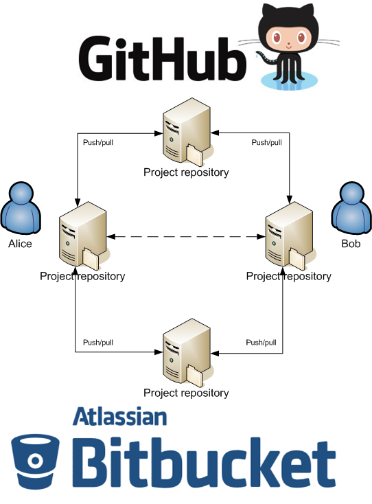
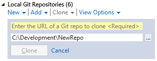
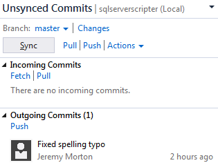
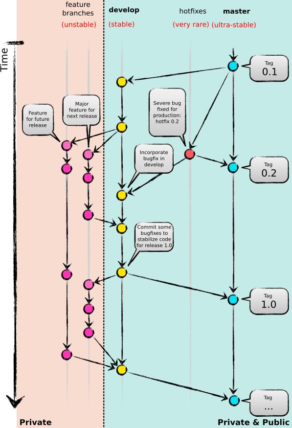
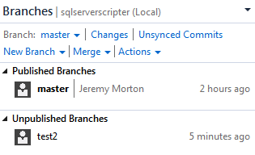

# Git tutorial
- [Introduction](#user-content-introduction)
- [Cloning a repo](#user-content-cloning-a-repo)
- [Pushing and pulling changes](#user-content-pushing-and-pulling-changes)
- [Typical Git workflow](#user-content-typical-git-workflow)
- [Branching and merging](#user-content-branching-and-merging)
- [DON'T use `git stash`!](#user-content-dont-use-git-stash)
- [Further tutorials](#user-content-further-tutorials)
- [Other resources](#user-content-other-resources)

# Introduction
Git is a distributed version control system.  This means that every person working on a repository (repo) will have their own copy, which has either been created by themselves through `git init`, or "cloned" from another repo using `git clone`.

One important thing to note about distributed version control systems is that technically, no one repo is the "central" or "definitive" version.  Each repo can be thought of as a peer, equal to each other.  For example, this diagram could describe how Alice and Bob work together on a project using Git for source control:


Quite simply, they push and pull changes directly to and from each other's machines.  In practice this very rarely happens, but it illustrates the non-centralized nature of Git, and the fact that it is basically a sophisticated means for sending/receiving and applying patches between different machines.  This fundamental simplicity, though, is hardly a weakness, but a strength - when used with an effective workflow, Git can become a very powerful tool for good source control.

Often, a service such as [Github](https://github.com/) or [Bitbucket](https://bitbucket.org/) is used to host a Git repo.  While these services provide a lot of convenience and an agreed central place to share code to, they are fundamentally no more "central" than any other clone of the repo; it's just that teams tend to agree that they will treat the version of the repo stored on the Github/Bitbucket/etc. server as definitive.  So this diagram could describe how Alice and Bob work together on a project through Github or Bitbucket:



The two are sharing their codebase indirectly, using online services as a useful "middle man".  However, if desired, Alice could just as easily set up her Git configuration to pull updates from Bob's machine, rather than Github or Bitbucket.

# Cloning a repo
This document will assume that Github's copy is being considered by all team members as the definitive version of the repo being used for source control, and Github's repo will be called "public" whereas all other team members' local repos will be called "private".  The exact means for initializing this repo on a team member's machine depends on which tool is being used, but fundamentally it requires "cloning" the Github repo.  This means that a complete copy of the Github repo will be taken and stored locally on the user's machine.  The way to do this on the Git command line is:

```
git clone https://github.com/[user]/[repoName].git
```

... where `[user]` is the Github username under which the repo is stored, and `[repoName]` is the name of the repo.  This command will create a directory with the same name as `[repoName]`.  Inside the directory will be a `.git` subdirectory containing the Git repo data, and a checkout of the currently active branch of the source repo (usually `master`).  The way to clone a repositry in Visual Studio is via a GUI of course but follows the same principle:



# Pushing and pulling changes
Once the repo is cloned from Github, Git will have automatically set it up to "push" to and "pull" from Github's repo.  This means that by default, a `git push` will try to update Github's repo with changes made to your local one, and a `git pull` will try to update your local repo with changes made to Github's one.  Again, Visual Studio follows the same principle with its GUI allowing the user to "push" and "pull" changes:



# Typical Git workflow
Because of the distributed nature of Git, the typical workflow of somebody using it for source control is somewhat different from that of the workflow used with centralized source control systems like TFS and SVN.  Generally, it's best to keep relatively stable code that you wish others to access in branches that are pushed to the public repo while keeping "experimental" changes / features that you haven't finished working on yet / don't wish to share with others who may be working on the same feature, confined to private branches that aren't pushed to the public repo.  Only if/when that code becomes mature enough that you want others to pull it down to their private repos is it appropriate to publish it by pushing that branch to the public repo.  It's therefore worth keeping in mind that your Git repo branches can be considered either private or public, and it's fine (and common) to have a combination of both.  The following diagram shows a typical Git branching model:



With something as flexible as Git, there's always gonna be more than one way to do it, but this is an overview of a model that should work for teams whose members are working on multiple features simultaneously.  The "master" and "develop" branches are available in the public repo, and changes to them get pushed there and pulled from there regularly.  When a developer wishes to add a new feature, they'll create a private "feature branch" and start committing their changes into there.  Once that feature is ready, it can be merged back into the "develop" branch and then "develop" can be pushed to the public repo, keeping the (potentially) messy set of private developer branches away from the public repo.

Feature branches don't *have* to be private.  It's usually best for them to be, but if several developers are working on the same feature they may wish to push that branch to the public repo as well for easy sharing of code that they all check in to that branch.  It's generally a good idea, though, to tidy up these branches by deleting them from the public repo once they're finished with.  "develop" and "master", however, are intended to be long-lived.  "develop" is likely to be less stable than "master", as it will contain code that is in something like beta testing stage.  Occasional merges from "develop" into "master" should only be done when it's determined that the "develop" code is in a mature and stable state.  That way, it can be assured that each commit to the "master" branch just holds versions of the codebase that are relatively stable and should compile properly, not contain messy commented-out code, etc.  Because the "master" branch will be so stable, it's probably a good idea to consider each merge into that branch to be a new release of the software and tag it with a version number, which also helps to keep things organized.

For an example of a simple workflow that should minimize issues with merge conflicts, [see here](WORKFLOWEXAMPLE.md).

# Branching and merging
As you probably realized from above, branching in Git is effortless and can (and should) be done on-the-fly when desired.  Whereas before one might have made some experimental changes and created a shelveset to hold them so they didn't need to be checked into the central server, with Git these changes can simply be committed to a new local branch.  If branching was a heavyweight operation before because you had to contact the central server to do it, consider that Git basically *is* a source control server... and it's on your machine.  So use it freely for branching and merging, without even having to touch the network.  For example, if you were working on the "develop" branch and had modified some files to add new functionality, you could store those changes using the following:

```
git checkout -b coolNewFeature
git add -A
git commit -m "First work on cool new feature."
git checkout develop
```

The above commands first switch to the local branch "coolNewFeature" (while creating that branch on-the-fly), add the modifications to the staging area so they will be included in the next commit, commit the changes with a brief log message, and switch back to the "develop" branch again.  Your codebase will then be back at the state of the "develop" branch before you had added the new functionality, but those changes will still be stored in the "coolNewFeature" branch which you can get back to with `git checkout coolNewFeature`.  Visual Studio's GUI for doing branching (and merging) refers to public and private branches as "published" and "unpublished" branches:



There are 2 main ways to perform merging in Git: the more standard way where all of one branch's changes are merged into another one-by-one.  If at any time a merge conflict is detected, merging will halt and allow for the user to fix the conflicts, or abandon the merge, returning the codebase to its pre-merge state.  This merging is handled in Visual Studio using the same above GUI as is used with branching, and the normal commandline to merge one local branch into the current checked out local branch is:

```
git merge [branchName]
```

... where [branchName] is the name of the local branch whose changes you want to merge into the branch you are currently working in.

Another way to do merging in Git, which arguably results in a cleaner log history, is to first perform a `git rebase` on the current branch before merging.  Rebasing is beyond the scope of this document so please look in further resources to learn about this.

# DON'T use `git stash`!

At least, I recommend avoiding the use of stash.  When you have temporary changes to store, just stage them all and perform a `checkout -b [meaningful-branch-name]`.  That way you can easily store your temporary changes with a meaningful branch name and commit them to that branch with a meaningful commit message so you'll remember what you were doing with them later.  I find that when I stash changes, I just forget what they were all about.  The stash stack tends to build up with sets of changes and you'll just forget what they were all about.  In addition, when you `git stash pop`, that set of changes will NOT be cleared off the stash stack if there was a conflict, so you have to clear it manually, which is rather annoying.  Just use local temporary branches to store temporary work, which is what Git is good at anyway!

A side benefit to this is that it's easier to store newly-added files too.  By default, `git stash` will only stash changes to files already commites to the repo, and not new files.  Add all to the index and checking in to a temporary new branch will allow you to commit these new files with no problem.

# Further tutorials
- [Setting up Git for Windows](SETUPWIN.md)
- [Simple workflow example](WORKFLOWEXAMPLE.md)
- [Deleting a branch](DELETEBRANCH.md)
- [Deleting file(s) from a repo's history](DELETING.md)
- [Creating and updating submodules](SUBMODULES.md)

# Other resources
- Please fork this repo and feel free to make a pull request if you think this tutorial can be improved!
- [A successful Git branching model](http://nvie.com/posts/a-successful-git-branching-model/)
- [Git reference documentation](http://git-scm.com/docs/)
- [Git community](http://git-scm.com/community)
- [Atlassian Git tutorial](https://www.atlassian.com/git/tutorials/)
- [Linus Torvalds on Git ('What would CVS not do?')](https://www.youtube.com/watch?v=4XpnKHJAok8)
