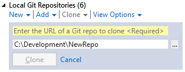
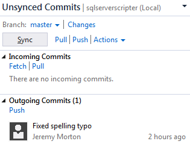
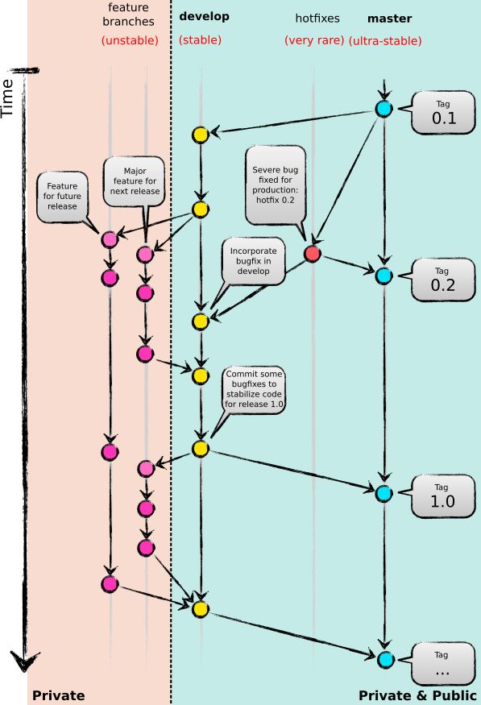

# Git Tutorial
Git is a distributed version control system.  This means that every person working on a repository (repo) will have their own copy, which has either been created by themselves through `git init`, or "cloned" from another repo using `git clone`.

One important thing to note about distributed version control systems is that technically, no one repo is the "central" or "definitive" version.  Each repo can be thought of as a peer, equal to each other.  For example, this diagram could describe how Alice and Bob work together on a project using Git for source control:

(diagram1)

Quite simply, they push and pull changes directly to and from each other's machines.  In practice this very rarely happens, but it illustrates the non-centralized nature of Git.  Often, a service such as [Github](https://github.com/) or [Bitbucket](https://bitbucket.org/) is used to host a Git repo.  While these services provide a lot of convenience and an agreed central place to share code to, they are fundamentally no more "central" than any other clone of the repo; it's just that teams tend to agree that they will treat the version of the repo stored on the Github/Bitbucket/etc. server as definitive.  So this diagram could describe how Alice and Bob work together on a project through Github or Bitbucket:

(diagram2)

However Alice could just as easily set up her Git configuration to pull updates from Bob's machine, rather than Github or Bitbucket.

# Cloning a repo
This document will assume that Github's copy is being considered by all team members as the definitive version of the repo being used for source control, and Github's repo will be called "public" whereas all other team members' local repos will be called "private".  The exact means for initializing this repo on a team member's machine depends on which tool is being used, but fundamentally it requires "cloning" the Github repo.  This means that a complete copy of the Github repo will be taken and stored locally on the user's machine.  The way to do this on the Git command line is:

```
git clone https://github.com/[user]/[repoName].git
```

... where `[user]` is the Github username under which the repo is stored, and `[repoName]` is the name of the repo.  This command will create a directory with the same name as `[repoName]`.  Inside the directory will be a `.git` subdirectory containing the Git repo data, and a checkout of the currently active branch of the source repo (usually `master`).  The way to clone a repositry in Visual Studio is via a GUI of course but follows the same principle:



# Pushing and pulling changes
Once the repo is cloned from Github, Git will have automatically set it up to "push" to and "pull" from Github's repo.  This means that by default, a `git push` will try to update Github's repo with changes made to your local one, and a `git pull` will try to update your local repo with changes made to Github's one.  Again, Visual Studio follows the same principle with it's GUI allowing the user to "push" and "pull" changes:



# Typical Git workflow
Because of the distributed nature of Git, the typical workflow of somebody using it for source control is somewhat different from that of the workflow used with centralized source control systems like TFS and SVN.  Generally, it's best to keep relatively stable code that you wish others to access in branches that are pushed to the public repo while keeping "experimental" changes / features that you haven't finished working on yet / don't wish to share with others who may be working on the same feature, confined to private branches that aren't pushed to the public repo.  Only if/when that code becomes mature enough that you want others to pull it down to their private repos is it appropriate to publish it by pushing that branch to the public repo.  It's therefore worth keeping in mind that your Git repo branches can be considered either private or public, and it's fine (and common) to have a combination of both.  The following diagram shows a typical Git branching model:


