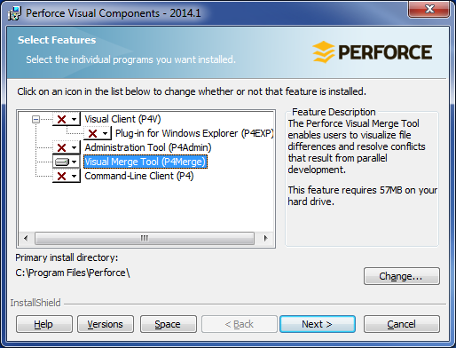
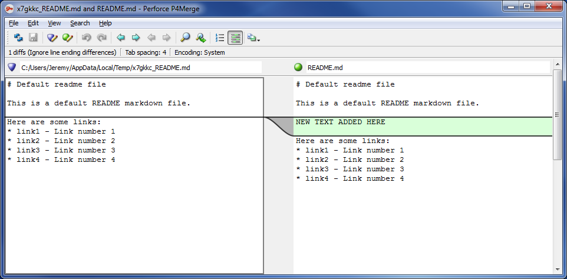

[Back to index](README.md)
# Setting up Git for Windows
First, download the official Git for Windows client from the official website: https://git-scm.com/

During installation, it's recommended that you "Use Git from Git Bash only", which will avoid accidental running of Git commands from a non-Git commandline (generally you only need to run Git commands from the GIt commandline).  Also select MinTTY as the terminal emulator.  IMPORTANTLY, you need to make sure "Enable Git Credential Manager" is *unchecked* unless you want the (relatively insecure) Credential Manager popup to store your login credentials long-term.  If you do install this, you'll need to later remove the Credential Manager as a helper by running the bash shell as administrator and removing it from the system config through:
```
git config -e --system
```

Once Git is installed, run "Git Bash", which will open up a Git commandline window (Bash shell) using the MinTTY terminal emulator.  You'll want to configure your Git global settings and it's highly recommended to set up merge and diff tools.

# Main config
Run the following command in the terminal emulator to get access to the Git global configuration:
```
git config -e --global
```
The default editor that will be used to edit this configuration is "Vim".  You'll need to press "i" to enter "insert mode" which allows you to insert/delete characters normally.  When finished editing, press "esc" to exit insert mode, then type `:wq` and hit enter which `w`rites the config, then `q`uits the program and returns to the commandline.

Your initial config should look pretty empty.  You'll want to set it up to look something like this:
```
[user]
	name = Joe Bloggs
	email = joebloggs@[yourDomain].com
[push]
	default = current
[core]
	autocrlf = true
	askpass =
[alias]
	clone = clone --recursive
```
... obviously putting your actual name and e-mail address into the `[user]` section.

The `[push]` setting will mean that only the branch you're currently on gets pushed on a `git push` by default, which is almost always the desired behaviour, and the `[core]` setting will mean that `LF`-style newlines get checked into the repo, enforcing newline consistency.  The only editor that doesn't support these line endings is Windows Notepad, so never use that.  It's terrible, anyway.  The `[alias]` for the `clone` command adds `--recursive`, meaning any submodules' contents will get checked out at the same time as the repo being cloned; this is almost always desired behaviour.  The `askpass =` is not a typo; it disables the SSH shell's credentials popup and makes it prompt for the password on the commandline instead (this combines with disabling the Git Credential Manager, mentioned above, ensuring that credentials are simply prompted for on the commandline).

# Bash config
It's probably worth creating a startup script for when you open the Bash shell, even if only to change directory to where you usually do your development (you don't want to manually navigate there every time).  The startup script is located in your home directory, accessible in Bash using the tilde character (`~`).  The file that used to get automatically executed was `.bashrc` but MinTTY now auto-executes `.bash_profile` instead.  To create a startup script, first get into your home directory in Bash and start editing your startup script:
```
cd ~
vi .bash_profile
```
... then - assuming it's currently empty or doesn't exist - put something like the following in:
```
# Git bash startup script
# Execute .bashrc if it exists
if [ -f ~/.bashrc ]
then
	. ~/.bashrc
fi

# Change to development directory
cd /c/Development/
```
This will mean that you start out in the `C:\Development\` directory every time you start the Bash shell (assuming `C:\Development\` is your main development directory in which you store your Git repos).

# Merge and diff tools
The built-in merge and diff tooling in Git is commandline-based and very basic.  It's a good idea to set up merge and diff tools for performing these operations in Git.

Git bash shell comes with various merge and diff tools preconfigured, and if you're using one of these tools all you need to do is tell Git in a config setting which tool you're using.  One such tool is Perforce's P4Merge, which is highly recommended as it has a nice GUI and supports 3-way merging.

Firstly, install P4merge itself.  An installer that is compatible with 64-bit Windows 7 or later can be found in this repo at `setups/p4vinst64.exe`.

In order to just install P4Merge and not other unnecessary components, when installing the "Perforce Visual Components for 64-bit systems", deselect every feature ("This feature will not be installed...") except for "Visual Merge Tool (P4Merge)":



Because of the preconfigured scripts that come with the Git bash shell, it is now easy to setup Git to use this P4Merge installation, assuming `p4merge.exe` can be reached from the current `PATH` variable (it should be added by default upon install).  Open up Git's global config settings again:
```
git config -e --global
```
... and add the following:
```
[merge]
	tool = p4merge
```
Only the merge tool needs to be specified; the diff tool will default to being the same as the merge tool if it isn't specified in the config.

You can now test this setup out on a repo by using the P4Merge tool to look at the changes made to a file in the most recent revision.  Go into a Git repo that has at least a couple of commits in its history and run the command:
```
git difftool HEAD^
```
Launch `p4merge` for the first changed file and you should see something like this:



This means you have successfully installed Perforce P4Merge as your merge and diff tool.  Of course, Git can be configured to use other merge and diff tools if desired.

# Credentials
Whenever you push to or pull from a remote repository and need to authorize yourself to get permission, you will be prompted for a username and password.  This can get a little tiresome, but entering the password each time is a good idea to maintain security.  However, the username can be automatically supplied.

Using Git's credentials setup, you can automatically provide the username to a remote repository based on its URL by editing the global config and adding something similar to the following:
```
[credential "https://github.com"]
	username = yourGithubUsername
[credential "https://bitbucket.org"]
	username = yourBitbucketUsername
```
This will cause Git to automatically supply your username instead of prompting for it whenever necessary.  Note how you are able to supply different usernames automatically for different remote locations.

# Interacting with Git
Once Git for Windows is set up, there are a number of ways to interact with Git:
- Git bash shell

  The commandline shell that we've just been using is the main way to interact with Git.  The `git` command has lots of functionality which is widely documented on the web.  You can also get help from the built-in documentation with `git help` or for a particular command with `git help [command]`.
- Git GUI

  Git for Windows comes bundled with a basic UI for creating and managing repositories which can be started with the command `git gui`.
- Gitk

  Also bundled is a command that can be run from the Git bash shell, `gitk`.  This opens a GUI that shows the history of the current branch and provides commands for checking out a specific version.  It has to be run from within the repository you want to show history for.
- Visual Studio Git integration

  This obviously isn't part of Git for Windows, but from Visual Studio 2013 onwards, Visual Studio itself comes with Git functionality bundled into its user interface, which can be used for creating and managing repositories if you'd prefer.
